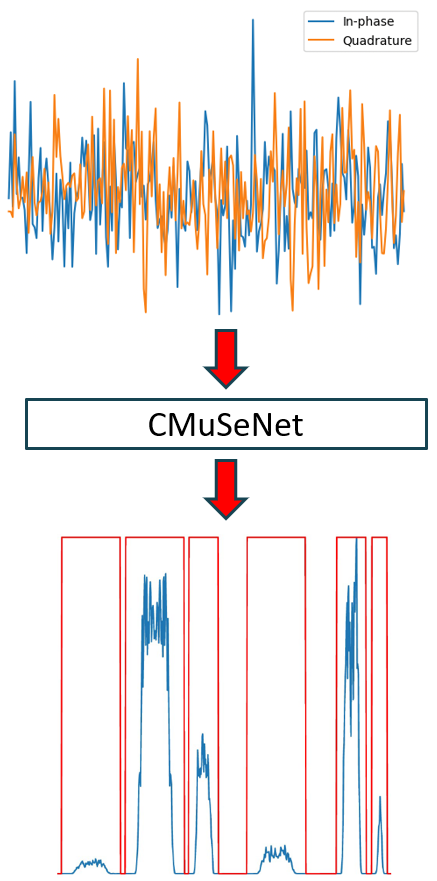
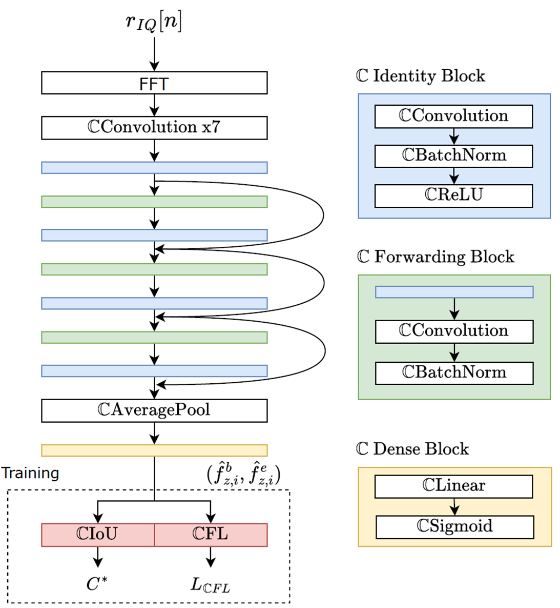
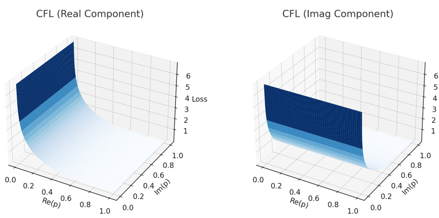
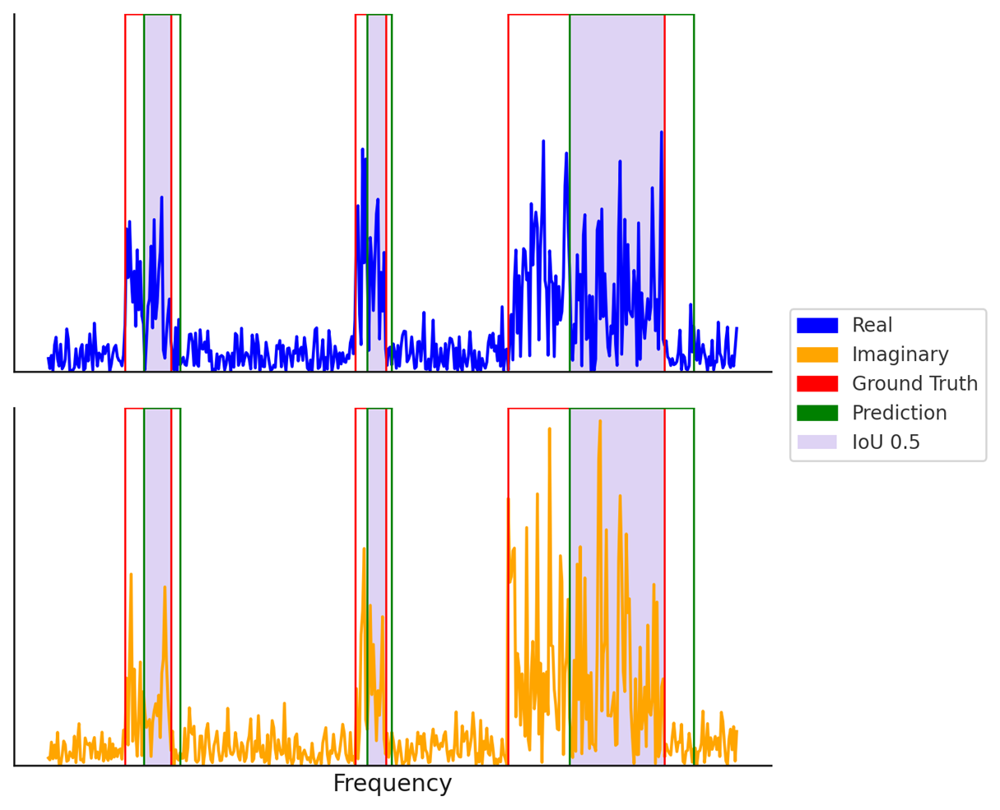

# CMuSeNet

> Complex-Valued Multi-Signal Segmentation Network for Cognitive Radio Systems.

---

[]()
[](https://huggingface.co/cpnlab/CMuSeNet)
[](https://ieee-dataport.org/documents/cv-musenet-complex-valued-multi-signal-segmentation-dataset-0)
[]()

---

## Overview

**CMuSeNet** is a Complex-Valued Neural Network (CVNN)-based residual architecture designed for wideband spectrum segmentation in challenging low-SNR environments.  
It leverages complex signal properties (phase, amplitude) inherently using complex-valued convolutions and introduces:

- **Complex-Valued Fourier Spectrum Focal Loss (CFL)** for robust low-SNR training
- **Complex Plane Intersection-over-Union (CIoU)** for accurate segmentation evaluation
- **Residual CVNN architecture** for enhanced feature extraction



**Key highlights:**
- Up to **9.2%** improvement in segmentation accuracy over RVNNs
- **99.4%** Average Accuracy over SNR of [-20, 10] dB with synthetic dataset and **98.98** Average Accuracy over SNR of [-10, 10] dB with Indoor OTA dataset
- **33.1%** reduction in total training time compared to RVNN models
- Achieves equivalent RVNN accuracy within **2 epochs** vs **27 epochs**
- Evaluated on Synthetic, Indoor Over-The-Air (OTA), and Real-World Broadband Irregularly-sampled Geographical Radio Environment Dataset (BIG-RED).
- Dataset publicly available on IEEE DataPort

## CMuSeNet Architecture

CMuSeNet employs a residual Complex-Valued Neural Network (CVNN) architecture based on complex convolutions, batch normalization, and CReLU activation.  
FFT preprocessing preserves signal phase and amplitude in the frequency domain before feeding into the network.



---

## Complex Fourier Spectrum Focal Loss (CFL)

CMuSeNet introduces a novel **Complex-Valued Fourier Spectrum Focal Loss (CFL)** to improve training for multi-signal segmentation under low-SNR conditions.

- Instead of reducing FFT outputs to real-valued magnitudes, CFL retains real and imaginary components separately.
- Applies a focal loss formulation on the **real** and **imaginary** parts of the Fourier spectrum.
- Focuses learning on **hard-to-detect weak signals** by dynamically adjusting the loss contribution.
- Allows the network to preserve **phase** and **amplitude** information crucial for accurate segmentation.

CFL enhances model robustness and convergence speed, achieving faster training and better low-SNR performance compared to real-valued losses.



---


## Complex Plane Intersection over Union (CIoU) Concept

Unlike traditional segmentation that treats outputs as magnitude-only, CMuSeNet evaluates predictions over the complex-valued Fourier spectrum using a novel CIoU metric.  
This treats real and imaginary axes jointly, improving boundary detection for signals in low-SNR environments.




Detailed technical description available in:

> **Reference:**  
> Sangwon Shin, Mehmet C. Vuran, “I Can’t Believe It’s Not Real: CV-MuSeNet: Complex-Valued Multi-Signal Segmentation”, in *Proc. IEEE Dynamic Spectrum Access Networks (DySPAN'25)*, IEEE, May 2025.

---

## Model and Dataset Links

- [Hugging Face Model](https://huggingface.co/cpnlab/CMuSeNet)
- [IEEE Dataport Dataset](https://ieee-dataport.org/documents/cv-musenet-complex-valued-multi-signal-segmentation-dataset-0)
- IEEE Xplore Publication: *(Link will be updated once available)*

---

## Requirements

- CUDA-capable NVIDIA GPU (e.g., Tesla V100)
- Intel CPU with i7 or higher
- Python 3.8
- Jupyter Notebook
- Anaconda (preferred) or pip

## Evaluation setup

- Intel Xeon Silver 4110 CPU
- NVIDIA Tesla V100 - 16GB VRAM
- 187 GB RAM

---

## Installation

### Anaconda (Recommended)

```bash
conda create -n cmusenet python=3.8
conda activate cmusenet

conda install tqdm
conda install pytorch torchvision torchaudio pytorch-cuda=12.4 -c pytorch -c nvidia
conda install -c conda-forge tensorflow
conda install scikit-learn
conda install numpy scipy matplotlib -y
conda install git
pip install git+https://github.com/wavefrontshaping/complexPyTorch.git
conda install -c anaconda ipykernel
```

### Pure pip (Alternative)

```bash
python -m venv cmusenet-env
source cmusenet-env/bin/activate  # (Linux/Mac) or .\cmusenet-env\Scripts\activate (Windows)

pip install tqdm
pip install torch torchvision torchaudio --index-url https://download.pytorch.org/whl/cu124
pip install tensorflow
pip install scikit-learn
pip install numpy scipy matplotlib
pip install gitpython
pip install git+https://github.com/wavefrontshaping/complexPyTorch.git
pip install ipykernel
```

---

## Quick Start

### Clone the Repository

```bash
git clone https://github.com/your_username/CMuSeNet.git
cd CMuSeNet
```

> Replace `your_username` with your GitHub ID if publishing!

### Launch Jupyter Notebook

```bash
jupyter notebook
```

Open and run:

- `Seek_VGG_ResNet_CVNN_RawComplexValue`
- `Seek_ResNet_CVNN_OTA`
- `BIGRED_Seek_ResNet_CVNN`

**Note:**  
Ensure datasets are downloaded and change the dataset direction in the code.

---

## Training and Evaluation

Each notebook contains detailed blocks for:

- Loading synthetic, Indoor-OTA, or Broadband Irregularly-sampled Geographical Radio Environment Dataset BIG-RED data
- Model initialization
- Training with complex-valued loss
- Validation metrics tracking (CIoU, CFL)

Hyperparameters tuned for low-SNR robustness:
- Batch size = 64
- Early stopping patience = 3
- CFL loss parameters γ = 1, α = 3

Transfer learning supported from Synthetic → OTA → BIG-RED datasets.

---

## Additional Citations

This project also uses [complexPyTorch](https://github.com/wavefrontshaping/complexPyTorch):

```bibtex
@misc{meunier2023complexpytorch,
  title={complexPyTorch},
  author={S\u00e9bastien Meunier},
  year={2023},
  publisher={GitHub},
  howpublished={\url{https://github.com/wavefrontshaping/complexPyTorch}}
}


## License

This project is licensed under the **GPL family** (General Public License) terms.  
Details will be updated following IEEE publication.

---

## Citation

If you use this code, dataset, or model, please cite:

```bibtex
@inproceedings{shin2025cmusenet,
  title={I Can't Believe It's Not Real: {CV-MuSeNet}: Complex-Valued Multi-Signal Segmentation},
  author={Sangwon Shin and Mehmet C. Vuran},
  booktitle={IEEE Dynamic Spectrum Access Networks (DySPAN)},
  year={2025},
  organization={IEEE}
}
```

## Acknowledgement
Office of Naval Research, NSWC Crane N00174-23-1-0007

This work relates to Department of Navy award N00174-23-1-0007 issued by the Office of Naval Research, NSWC Crane. Any opinions, findings, and conclusions or recommendations expressed in this material are those of the authors and do not necessarily reflect the views of the Office of Naval Research.

---
